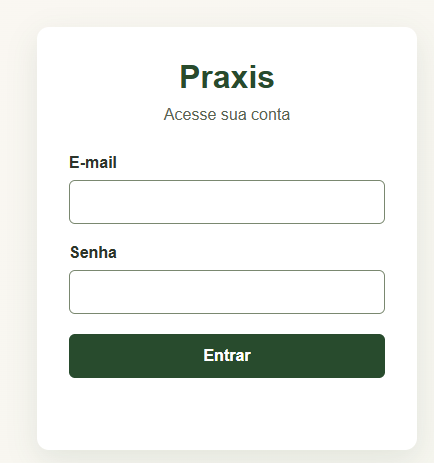
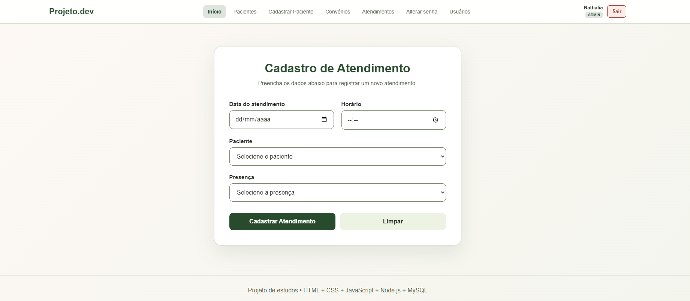
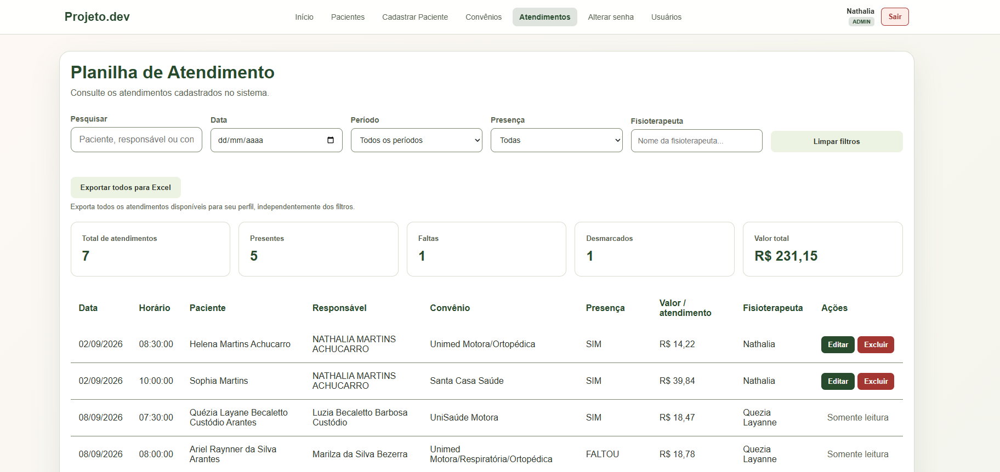
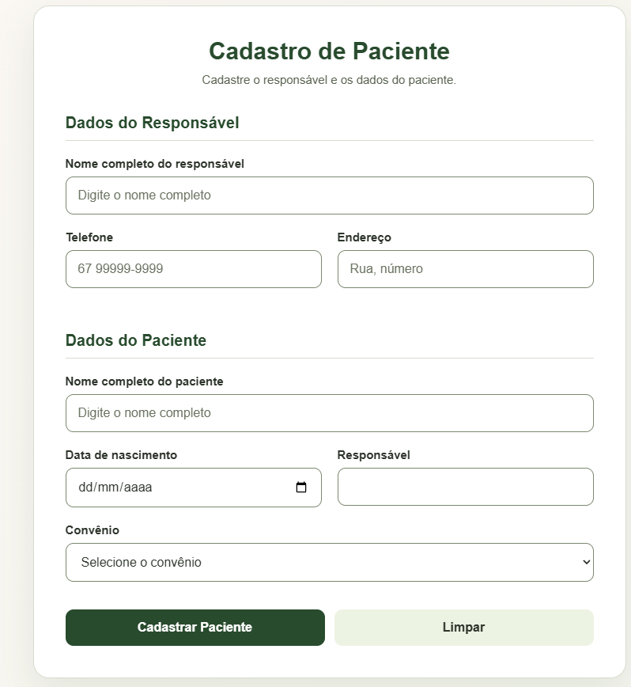
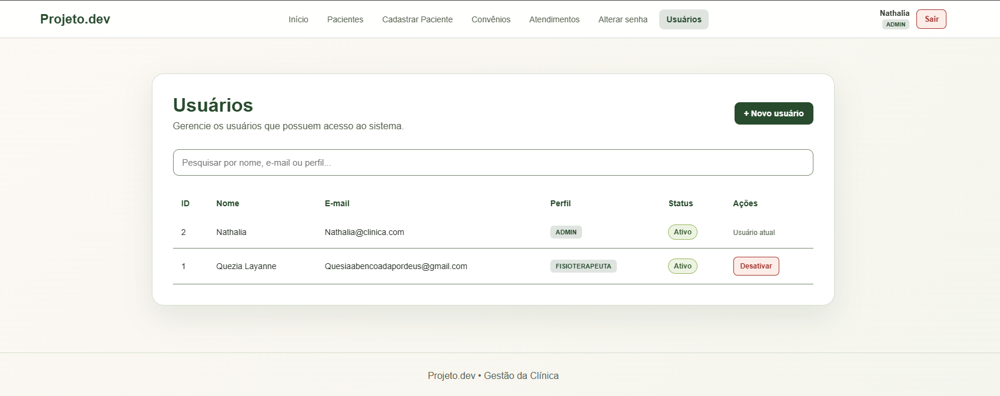

# Projeto Clínica — Praxis

Sistema web para gerenciamento de pacientes, convênios, usuários e atendimentos de uma clínica. A aplicação reúne front-end, API REST e banco de dados relacional, com autenticação segura e controle de acesso baseado no perfil do usuário.

> Projeto desenvolvido para aplicar, na prática, conhecimentos de desenvolvimento web, Node.js, APIs, MySQL, segurança e regras de negócio.

## Funcionalidades

- Autenticação e encerramento de sessão;
- troca obrigatória ou voluntária de senha;
- cadastro, consulta, atualização e exclusão de pacientes;
- cadastro e gerenciamento de responsáveis;
- cadastro, consulta, atualização e exclusão de convênios;
- cadastro, consulta, atualização e exclusão de atendimentos;
- controle de presença com os estados `SIM`, `FALTOU` e `DESMARCOU`;
- gerenciamento e ativação ou desativação de usuários;
- exportação dos atendimentos para uma planilha Excel;
- validação dos dados e tratamento centralizado de erros;
- interface responsiva para utilização pelo navegador.

## Regras de acesso

| Operação | FISIOTERAPEUTA | ADMIN |
| --- | --- | --- |
| Listar atendimentos | Apenas os próprios | Todos |
| Visualizar atendimento | Apenas os próprios | Qualquer atendimento |
| Cadastrar atendimento | Vinculado ao usuário autenticado | Vinculado ao usuário autenticado |
| Alterar ou excluir atendimento | Apenas os próprios | Conforme autorização do servidor |
| Consultar pacientes e convênios | Compartilhado | Compartilhado |
| Gerenciar usuários | Sem acesso | Acesso administrativo |
| Exportar atendimentos | Apenas os próprios | Todos |

Os pacientes e convênios são compartilhados entre os profissionais. Cada atendimento permanece associado ao usuário autenticado, evitando que um fisioterapeuta consulte registros pertencentes a outro profissional.

## Tecnologias

### Back-end

- Node.js;
- Express 5;
- MySQL 2;
- bcrypt;
- ExcelJS;
- dotenv.

### Front-end

- HTML5;
- CSS3;
- JavaScript;
- Fetch API.

### Qualidade e segurança

- Testes com o módulo nativo `node:test`;
- queries parametrizadas;
- senhas protegidas com bcrypt;
- sessão opaca armazenada em cookie `HttpOnly`;
- tokens armazenados no banco apenas como hash SHA-256;
- proteção contra CSRF;
- limitação de tentativas de login e troca de senha;
- expiração absoluta e por inatividade das sessões;
- revogação de sessões após troca de senha ou alteração de status;
- exigência de HTTPS e TLS para conexões remotas em produção;
- controle de autorização realizado no servidor.

Mais detalhes estão disponíveis em [`docs/SEGURANCA-FASE-2.md`](docs/SEGURANCA-FASE-2.md).

## Arquitetura

O back-end foi organizado em camadas para separar as responsabilidades:

```text
src/
├── config/          # Banco de dados e configurações de segurança
├── controllers/     # Entrada e saída das requisições HTTP
├── middlewares/     # Autenticação, autorização e tratamento de erros
├── repositories/    # Consultas e operações no MySQL
├── routes/          # Endpoints da API
├── services/        # Regras de negócio
├── app.js           # Configuração da aplicação Express
└── server.js        # Inicialização do servidor
```

Outras pastas importantes:

```text
client/              # Telas, estilos e scripts do front-end
database/            # Esquema e migrações do banco de dados
scripts/             # Provisionamento e verificações de segurança
tests/               # Testes automatizados
certificates/        # Certificados públicos usados na conexão TLS
```

## Páginas da aplicação

| Página | Finalidade |
| --- | --- |
| `login.html` | Autenticação |
| `index.html` | Cadastro de atendimento |
| `atendimentos.html` | Consulta e gerenciamento de atendimentos |
| `paciente.html` | Cadastro de paciente e responsável |
| `pacientes.html` | Consulta e gerenciamento de pacientes |
| `convenio.html` | Gerenciamento de convênios |
| `usuarios.html` | Administração de usuários |
| `senha.html` | Alteração de senha |


### Pré-requisitos

- [Node.js](https://nodejs.org/) 18 ou superior;
- [MySQL](https://www.mysql.com/) 8 ou superior;
- Git.

## Testes

Execute a suíte automatizada com:

```bash
npm test
```

Os testes verificam autenticação, sessões, permissões, proteção das rotas, comportamento do front-end, renderização segura e exportação para Excel.

## Endpoints principais

| Método e rota | Descrição |
| --- | --- |
| `POST /api/auth/login` | Inicia uma sessão |
| `POST /api/auth/logout` | Encerra a sessão atual |
| `GET /api/auth/me` | Retorna o usuário autenticado |
| `POST /api/auth/senha` | Altera a senha |
| `GET /api/pacientes` | Lista os pacientes |
| `POST /api/pacientes` | Cadastra paciente e responsável |
| `GET /api/convenios` | Lista os convênios |
| `POST /api/convenios` | Cadastra um convênio |
| `GET /api/atendimentos` | Lista os atendimentos permitidos |
| `POST /api/atendimentos` | Cadastra um atendimento |
| `GET /api/atendimentos/exportar` | Exporta os atendimentos para Excel |
| `GET /api/usuarios` | Lista usuários para o administrador |
| `POST /api/usuarios` | Cadastra um usuário |

## Demonstração

1. login; 
2. cadastro de atendimento; 
3. listagem de atendimentos; 
4. cadastro de pacientes; 
5. gerenciamento de usuários. 
   

## Próximas melhorias

- incluir testes de integração com um banco isolado;
- documentar a API com OpenAPI/Swagger;
- adicionar integração contínua com GitHub Actions.

## Autor

Desenvolvido por **Ariel Raynner**.

- GitHub: [@Raynner](https://github.com/Raynner)
- LinkedIn: [Ariel Raynner] (https://www.linkedin.com/in/ariel-raynner-995506370/)

## Aviso

Este projeto possui finalidade educacional e utiliza dados fictícios. Não utilize dados reais de pacientes em ambientes de demonstração.
